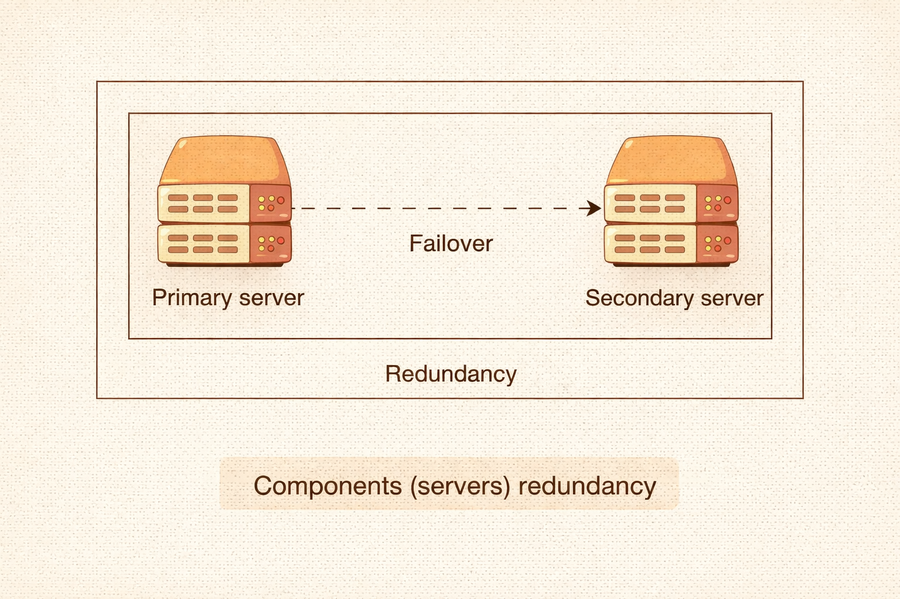

# System Design — Core Concepts

> **Goal:** Understand what problem each building block solves.

## 1. Storage

* Where is data stored?
* How is it accessed?
* How is it protected from loss?
* Types: SQL, Key-Value, Document, Object Storage
* Choose based on **access patterns + constraints**

## 2. Sharding

* Split data across multiple nodes.
* Split by: `User ID / Region / Time`
* Consider:

  * Even distribution
  * Query routing
* Bad sharding → **Hot Spots + Uneven Load + Hard Migrations**

## 3. Replication

* Keep multiple copies of data.
* Goals:

  * Fault Tolerance
  * High Availability
  * Faster Reads
* Decide:

  * Number of replicas
  * Sync vs Async
  * Conflict resolution
* More reliability → More complexity / consistency issues

## 4. Caching

* Store frequently accessed data closer/faster.
* Types:

  * In-process
  * Distributed (Redis-like)
  * CDN
* Decide:

  * What to cache?
  * How long?
  * Cache invalidation?
* Bad caching → **Stale Data + Bugs**

## 5. Load Balancing

* Distribute traffic across multiple servers.
* Types:

  * DNS
  * Network
  * Application
* Consider:

  * Traffic patterns
  * Health checks
  * Failure handling

## 6. Message Queues

* Move work to asynchronous/background processing.
* Benefits:

  * Handle traffic spikes
  * Better responsiveness
  * Decouple components
* Need to handle:

  * Retries
  * Ordering
  * Failures
  * Eventual consistency

## 7. Rate Limiting

* Protect system from **abuse / overload**.
* Decide:

  * Where to enforce?
  * How to track?
  * What happens when limit is exceeded?
* Related to **Reliability + UX**

## 8. CDN

* Serve static/semi-static content from locations closer to users.
* Reduces:

  * Latency
  * Origin server load
  * Bandwidth cost
* Decide what can safely be served from the edge.

## 9. Consistency

Distributed systems balance:

**Consistency + Availability + Partition Tolerance**

Think about:

* Stale Reads
* Write Conflicts
* Strong vs Eventual Consistency

> **Trade-offs are unavoidable.**

## 10. Decoupling

* Separate responsibilities into clear components/services.
* Benefits:

  * Easier scaling
  * Independent deployments
  * Better fault isolation
* Bad boundaries → **Tight Coupling + Complexity**

---

## 🧠 Core Mindset

For every component, ask:

> **What problem does it solve?**

```text
Storage       → Store Data
Sharding      → Scale Data
Replication   → Reliability / Availability
Caching       → Performance
Load Balancer → Distribute Traffic
Queue         → Async Work / Decoupling
Rate Limit    → Protect System
CDN           → Faster Content Delivery
Consistency   → Correct Data Behavior
Decoupling    → Independent Components
```
