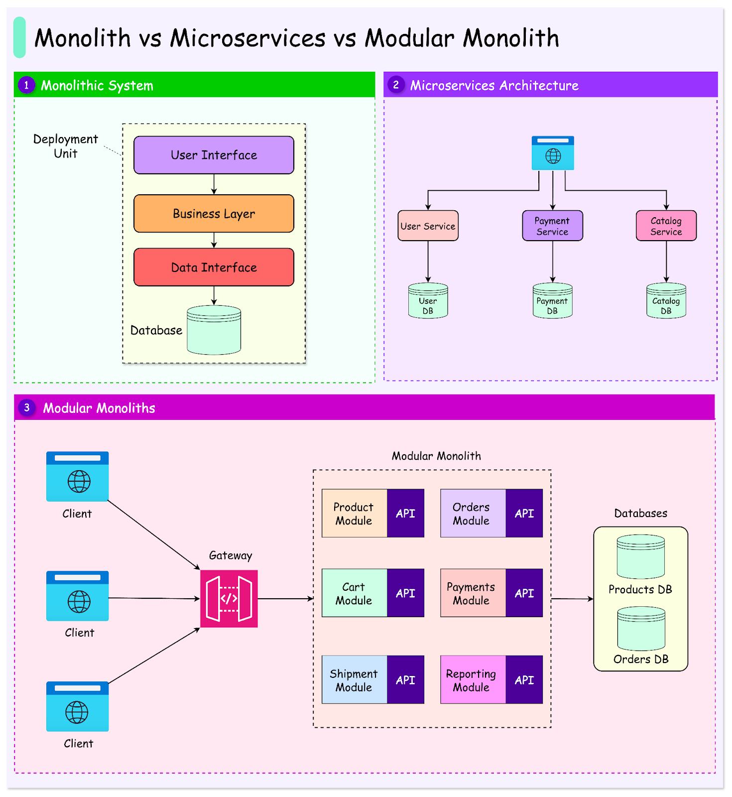
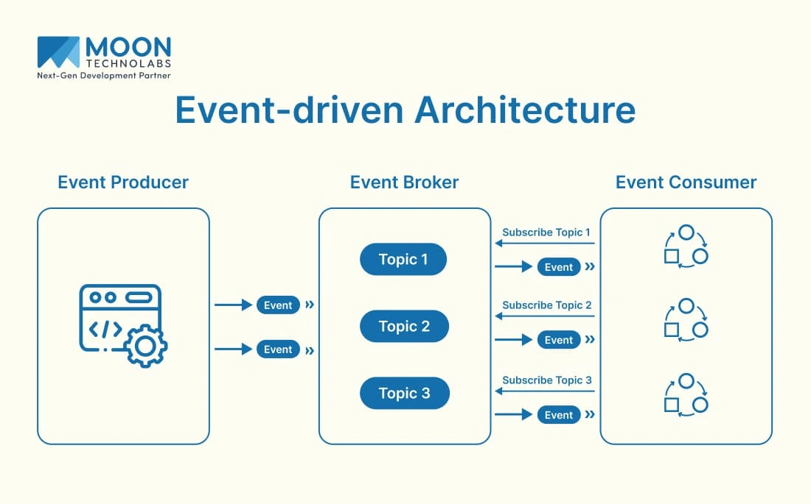

# 1. Monolithic Architecture

* **Structure:** Entire application is built as a **single unified codebase** and deployable unit.
* **Components:** User interface, business logic, and database access are bundled together.
* **Best for:** Startups and small teams.
* **Pros:**

  * Simplifies development and testing.
  * Single-step deployment.
  * Fast internal communication with no network calls between components.
* **Cons:**

  * Becomes rigid as the codebase grows.
  * Harder for teams to work independently.
  * Small changes may require regression testing for the whole system.
  * Slower release cycles.

### Trade-off

> **Gains:** Simplicity and performance.
> **Sacrifices:** Independent scalability and flexibility.

---

# 2. Microservices Architecture

* **Structure:** System is split into **independently deployable services**.
* **Responsibility:** Each service handles a specific domain.
* **Communication:** APIs or message queues.
* **Best for:** Complex applications with evolving requirements.
* **Pros:**

  * Each service has its own codebase, database, and release schedule.
  * Teams can develop, deploy, and scale services independently.
  * Services can use different programming languages if needed.
* **Cons:**

  * Increases architectural complexity.
  * Requires service discovery, load balancing, logging, and fault tolerance.
  * Requires managing inter-service contracts and monitoring distributed systems.

### Trade-off

> **Gains:** Scalability, flexibility, and independence.
> **Sacrifices:** Simplicity.

---

# 3. Event-Driven Architecture

* **Structure:** System is built around the **production, detection, and consumption of events**.
* **Communication:** Services emit events instead of making direct synchronous requests.
* **Decoupling:** Components are **loosely coupled**; producers don't need to know which services consume their events.
* **Best for:** Real-time systems such as:

  * Order Tracking
  * Analytics
  * User Activity Logging
  * Automation Workflows

### Pros

* Flexible and extensible.
* Better fault isolation.
* New features can subscribe to events without modifying core logic.
* Services can scale independently.

### Cons

* Events can be delayed, duplicated, or lost.
* Requires **Eventual Consistency**.
* Needs careful Event Schemas and Idempotent Handlers.
* Debugging requires Observability and tracing for asynchronous workflows.

### Trade-off

> **Gains:** Loose coupling, scalability, and extensibility.
> **Sacrifices:** Simplicity and easier consistency.

