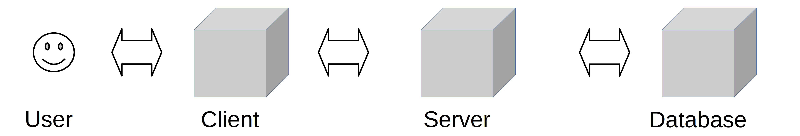
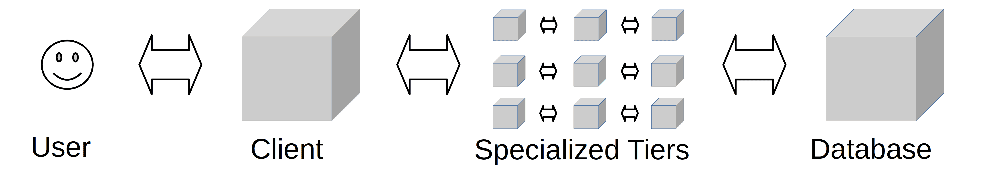

# Three-Tier Architecture



## What Is Three-Tier Architecture?

Three-Tier Architecture organizes an application into **three logical and physical tiers**:

```text
Presentation Tier
       ↓
Application Tier
       ↓
Data Tier
```

### Main Benefits

* **Faster Development** → Each tier can be developed independently.
* **Scalability** → Each tier can be scaled independently.
* **Reliability** → Failure in one tier is less likely to affect the others.
* **Security** → The Application Tier separates the Presentation Tier from the Data Tier.

---

## 1. Presentation Tier

The **Presentation Tier** is the user interface and communication layer.

Responsibilities:

* Display information to the user.
* Collect input from the user.
* Handle user interaction.

Examples:

```text
Web Browser
Desktop Application
GUI
```

Web applications commonly use:

```text
HTML
CSS
JavaScript
```

---

## 2. Application Tier

The **Application Tier** is also called the **Logic Tier** or **Middle Tier**.

It is the **heart of the application**.

Responsibilities:

* Process user input.
* Apply **Business Logic** and business rules.
* Add, delete, or modify data in the Data Tier.
* Communicate with the Data Tier through APIs.

Example:

```text
User
 ↓
Application Tier
 ↓
Business Logic
 ↓
Database
```

---

## 3. Data Tier

The **Data Tier** is also called the **Database Tier**, **Data Access Tier**, or **Backend Tier**.

Responsibilities:

* Store data.
* Manage data.
* Retrieve data.
* Process data.

Examples:

```text
PostgreSQL
MySQL
Oracle
MongoDB
Cassandra
```

---

## Communication

In Three-Tier Architecture:

```text
Presentation Tier
        ↓
Application Tier
        ↓
Data Tier
```

The **Presentation Tier cannot communicate directly with the Data Tier**.

All communication goes through the **Application Tier**.

```text
Presentation ───X──→ Data
       │
       ↓
 Application
       │
       ↓
     Data
```

---

# Three-Tier in Web Development

The tiers have different names in web applications:

```text
Web Server
    ↓
Application Server
    ↓
Database Server
```

| Tier              | Web Component      | Responsibility            |
| ----------------- | ------------------ | ------------------------- |
| Presentation Tier | Web Server         | User Interface            |
| Application Tier  | Application Server | Business Logic            |
| Data Tier         | Database Server    | Data Storage & Management |

### Example

```text
User
 ↓
Web Server
 ↓
Application Server
 ↓
Database Server
```

---

# Two-Tier Architecture

Two-Tier Architecture consists of:

```text
Presentation Tier
        ↓
Data Tier
```

The **Business Logic** can exist in the Presentation Tier, Data Tier, or both.

The Presentation Tier has **direct access** to the Data Tier.

```text
Presentation ─────→ Data
```

Example:

* Simple Contact Management Application

---

# N-Tier Architecture

**N-Tier** (also called **Multitier**) refers to an application architecture with **more than one tier**.

Examples:

```text
2-Tier
3-Tier
4-Tier
...
N-Tier
```

Architectures with more than three tiers are less common because additional tiers can:

* Make the application slower.
* Make it harder to manage.
* Increase operational cost.

Therefore, **N-Tier** and **Multitier** are sometimes used as synonyms for **Three-Tier Architecture**.

---

# Tier vs Layer

| Layer                            | Tier                                          |
| -------------------------------- | --------------------------------------------- |
| Functional division of software  | Functional division + separate infrastructure |
| Can run on the same machine      | Runs on separate infrastructure               |
| Focuses on software organization | Focuses on software + deployment              |

Example:

```text
3 Layers on One Phone
        ↓
     1 Tier
```

But:

```text
Presentation → Server 1
Application  → Server 2
Data         → Server 3
        ↓
     3 Tiers
```

> **Layer = Functional separation**
> **Tier = Functional separation + Physical/Infrastructure separation**
