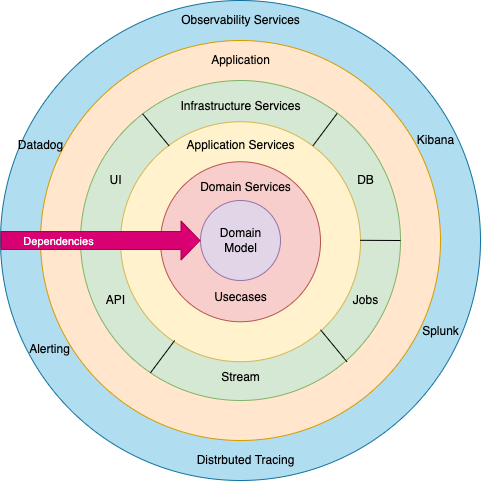

# Onion Architecture




## 1. Definition

> **Onion Architecture** is a domain-centric software architecture pattern
> made up of **4 concentric layers**, where the **Domain Model sits at the
> absolute center** with zero external dependencies, wrapped by
> **Domain Services**, then **Application Services**, with
> **Infrastructure and UI as the outermost, most replaceable ring**.

**Key idea to remember:**
- Onion = concentric circles (like layers of an onion)
- It has **4 layers**, from center → outward:
  1. Domain Model
  2. Domain Services
  3. Application Services
  4. Infrastructure / UI
- Golden rule: **Dependencies point inward only**
- The innermost circle (Domain) knows nothing about anything outside it
- The outermost circle (Infrastructure) is the only one that "knows" the
  actual technology (DB, Framework, UI)

---

## 2. Pros

- **Business logic independence** — the domain model has zero dependency on
  frameworks, databases, or UI
- **High testability** — core business rules can be unit tested with plain
  objects, no database or web server needed
- **Technology flexibility** — swap SQL Server for MongoDB, or REST for
  GraphQL, without touching business logic
- **Rich domain model** — entities carry their own behavior and enforce
  their own rules (not anemic data bags)
- **Natural fit for DDD** — Domain Services and domain events slot in
  cleanly
- **Fewer files than Clean Architecture** — one service class with many
  methods, not a folder per action

---

## 3. Cons

- **Overkill for small projects** — too much structure for a simple CRUD
  app
- **Steeper learning curve** — Dependency Inversion takes time to fully
  grasp
- **More boilerplate** — interfaces, DTOs, mapping code
- **Service classes can grow large** — a constructor's dependency list only
  grows over time
- **Less self-documenting than Clean** — no dedicated "Use Cases" folder to
  scan and see everything the system does
- **Cargo-cult risk** — folder names alone (`Domain`, `Application`,
  `Infrastructure`) don't guarantee the Dependency Rule is actually
  followed

---

## 4. Structure

### Layers (center → outward)

```
1. Domain Model        → Entities + Value Objects (zero dependencies)
2. Domain Services      → Logic spanning multiple entities + repository interfaces
3. Application Services → Orchestrates use cases end-to-end, returns DTOs
4. Infrastructure/UI    → EF Core, ASP.NET, DB, third-party SDKs (implements the interfaces)
```

### Project folder structure

```
MyApp.Domain/
├── Entities/
├── ValueObjects/
├── Interfaces/
│   ├── Repositories/  → IOrderRepository.cs
│   └── Services/      → IEmailSender.cs

MyApp.Domain.Services/
├── PricingService.cs

MyApp.Application/
├── Services/  → OrderService.cs
├── DTOs/

MyApp.Infrastructure/
├── Persistence/  → AppDbContext.cs, OrderRepository.cs
├── Email/        → SmtpEmailSender.cs

MyApp.API/
├── Controllers/  → OrdersController.cs
└── Program.cs
```

### Dependency direction

```
Infrastructure/UI → Application Services → Domain Services → Domain Model
```

Interfaces are declared inside the **inner** layers (Domain / Domain
Services) and **implemented** in the **outer** layer (Infrastructure) —
this is Dependency Inversion.

---

## 5. Trade-off

- **Gain:** full dependency inversion + testability, less ceremony than
  Clean, aligns naturally with DDD
- **Pay:** less explicit "map" of what the system does, and services can
  bloat if not kept in check

---

## 6. When to Use It

- Medium-to-large, long-lived systems with real domain complexity
- Teams already comfortable with classic OOP service classes (not
  command/handler-per-action style)
- Projects using DDD concepts: rich entities, domain events, Unit of Work
