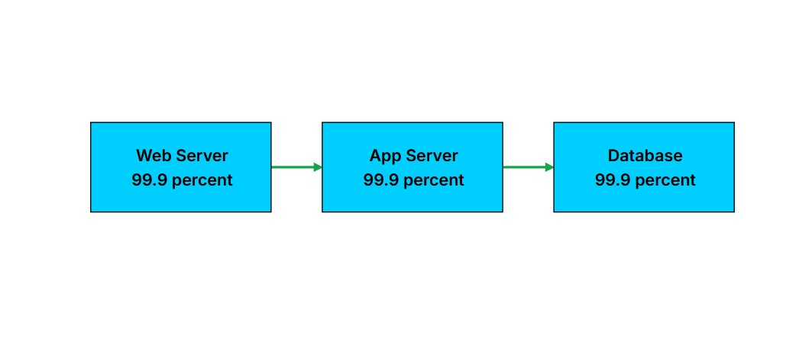
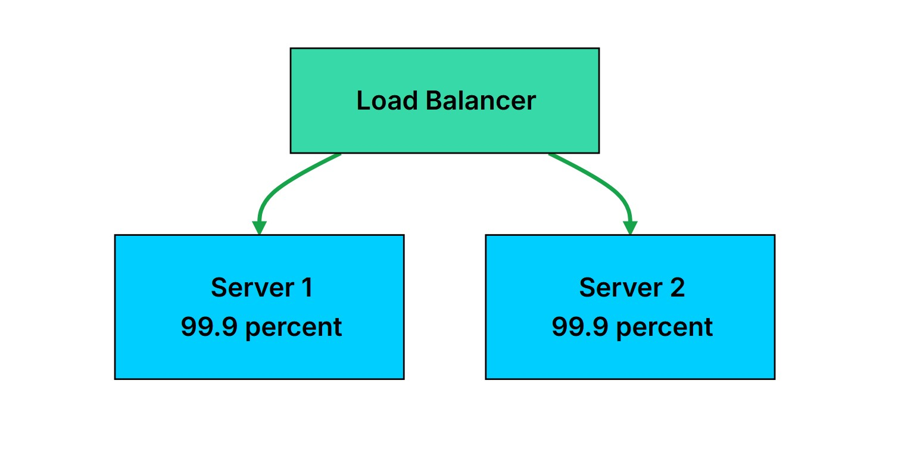

# Availability

**Availability** is the ability of a system to remain **operational and accessible** to users, even when individual components fail.

> **Scalability** → Handle more load.
> 
> **Availability** → Stay operational during failures
> 
> **Reliability** → Produce correct results consistently

---

## Availability vs Reliability

They are related but different:

* **Availability:** Is the system up and accessible?
* **Reliability:** Does the system work correctly?

A system can be highly available but unreliable.

---

# Measuring Availability

```text
Availability = Uptime / (Uptime + Downtime)
```

Example:

```text
Uptime = 364 days
Downtime = 1 day

Availability = 364 / 365
             = 99.73%
```

---

# The Nines

Availability is commonly described using **nines**.

Each additional nine reduces the allowed downtime by roughly **10×**.

| Availability | Downtime / Year |
| ------------ | --------------: |
| 99%          |       3.65 days |
| 99.9%        |      8.76 hours |
| 99.99%       |    52.6 minutes |
| 99.999%      |    5.26 minutes |
| 99.9999%     |    31.5 seconds |

---

# Components in Series


In **series**, all components must work for the system to work.

```text
Web Server
    ↓
App Server
    ↓
Database
```

If each component has **99.9% availability**:

```text
Overall = 99.9% × 99.9% × 99.9%
        = 99.7%
```

> Adding more components in series decreases overall availability.

---

# Components in Parallel


In **parallel**, multiple components can handle the same workload.

```text
        ┌── Server 1
Request ┤
        └── Server 2
```

If one server fails, the other can continue serving requests.

For two servers with **99.9% availability**:

```text
Failure probability
= 0.1% × 0.1%
= 0.0001%

Availability
= 100% - 0.0001%
= 99.9999%
```

This is the power of **redundancy**.

> **Redundancy** = having backup components that can take over when another component fails.

---

# Common Failure Modes

## 1. Hardware Failures

Physical components can fail:

* HDD
* SSD
* Server
* Network Switch
* Power Supply

At large scale, hardware failures are **expected**, not exceptional.

---

## 2. Software Failures

Common examples:

* **Bugs** → Crashes or incorrect behavior
* **Memory Leaks** → Gradual resource exhaustion
* **Deadlocks** → Processes waiting for each other indefinitely
* **Cascading Failures** → One failure causes failures in dependent systems

---

## 3. Network Failures

* **Packet Loss** → Data does not reach its destination
* **Latency Spikes** → Communication becomes unusually slow
* **Network Partition** → Groups of servers become isolated
* **DNS Failure** → Domain names cannot be resolved

---

## 4. Human Errors

Production outages can also happen because of human mistakes:

* **Configuration Mistakes**
* **Failed Deployments**
* **Accidental Deletions**
* **Capacity Planning Errors**

Automation, testing, and operational safeguards help prevent or quickly recover from these mistakes.

---
# Redundancy

**Redundancy** is the foundation of **Availability**.

It means having **backup components** that can take over when the primary component fails.

> The goal: **No single failure should bring down the system.**

---

# Active-Passive

One component handles all traffic, while another waits as a backup.

```text
Traffic
   ↓
Primary Server → ACTIVE
                  ↓ Failover
Standby Server → PASSIVE
```

When the active server fails, the standby takes over.

### Best for

* Databases
* Stateful services
* Single-leader systems
* Controlled writes

### Pros

* Simple to understand
* Uses fewer resources
* Clear source of truth

### Cons

* Failover takes time
* Standby may not be tested under real load
* Can have **split-brain** problems

---

# Standby Types

| Type     | State                  | Failover          | Cost    |
| -------- | ---------------------- | ----------------- | ------- |
| **Cold** | Powered off            | Minutes           | Lowest  |
| **Warm** | Running, no traffic    | Seconds → Minutes | Medium  |
| **Hot**  | Running + synchronized | Seconds           | Highest |

### Cold Standby

Backup is **powered off**.

```text
Failure
  ↓
Boot → Start Services → Restore Data → Serve
```

* Cheapest
* Slowest
* Suitable for Disaster Recovery

### Warm Standby

Backup is **running but not serving traffic**.

* Can receive replicated data
* Faster than cold standby
* Needs promotion/routing changes

### Hot Standby

Backup is:

* Running
* Fully synchronized
* Ready to serve immediately

> Fastest but most expensive.

---

# Active-Active

All nodes handle traffic simultaneously.

```text
             ┌→ Server 1 ACTIVE
Load Balancer├→ Server 2 ACTIVE
             └→ Server 3 ACTIVE
```

If one server fails, the Load Balancer stops sending traffic to it.

The other servers continue handling requests.

### Pros

* No failover delay
* All nodes tested under real traffic
* Better resource utilization

### Cons

* More complex
* Data consistency is harder
* Requires stateless design or shared state

---

# Stateless vs Stateful

### Stateless

Any server can handle any request.

```text
Request → Server 1
Request → Server 2
Request → Server 3
```

Works naturally with **Active-Active**.

### Stateful

The service depends on stored state.

May require:

* Shared Storage
* Database
* Redis
* Sticky Sessions

> Sticky sessions can reduce some availability benefits because users become tied to specific servers.

---

# Geographic Redundancy

Redundancy inside one Data Center is not enough.

The entire Data Center can fail because of:

* Power outages
* Network failures
* Natural disasters
* Fiber cuts

So we can distribute the system across multiple physical locations.

```text
US East
   ↕
US West
   ↕
Europe
```

---

# Geographic Redundancy Levels

| Level                  | What It Is                          | Protects Against      | Latency  |
| ---------------------- | ----------------------------------- | --------------------- | -------- |
| **Availability Zones** | Separate Data Centers in one region | Single DC failure     | Low      |
| **Regions**            | Geographically separate locations   | Regional failures     | Higher   |
| **Multi-Cloud**        | Different cloud providers           | Cloud provider outage | Variable |

### Availability Zones

Usually the **sweet spot** for most applications.

They provide:

* Separate power
* Separate cooling
* Separate network
* Low latency between zones

---

# Multi-Region

Used when you need protection from **regional failures** or global availability.

Main challenge:

**Data Replication**

Synchronous replication across regions adds significant latency.

So many systems use:

**Asynchronous Replication**

```text
Primary Region
      ↓
Async Replication
      ↓
Secondary Region
```

This can mean losing the latest **seconds or minutes of data** during a disaster.

---

# Redundancy Across Layers

Redundancy must exist across the **whole stack**.

Having many App Servers is useless if you have only one Database.

```text
DNS 1 ─ DNS 2
     ↓
LB 1 ─ LB 2
     ↓
App 1 ─ App 2 ─ App 3
     ↓
Primary DB ─ Replica DB
```

Otherwise, the non-redundant component becomes a:

**Single Point of Failure (SPOF)**

> **True High Availability requires redundancy at every important layer.**

---

# Trade-off

Redundancy is **not free**.

More redundancy means:

* More servers
* More replicas
* More Availability Zones
* More cost
* More complexity

The goal is not necessarily **100% Availability**.

The goal is to find the right balance between:

```text
Availability ↑
     ↕
Cost + Complexity ↑
```

> **Design enough redundancy to reduce downtime risk to an acceptable level.**

