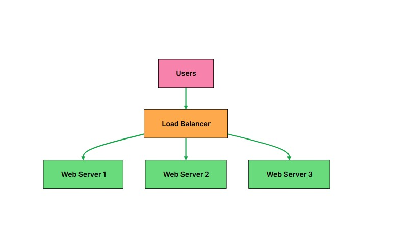
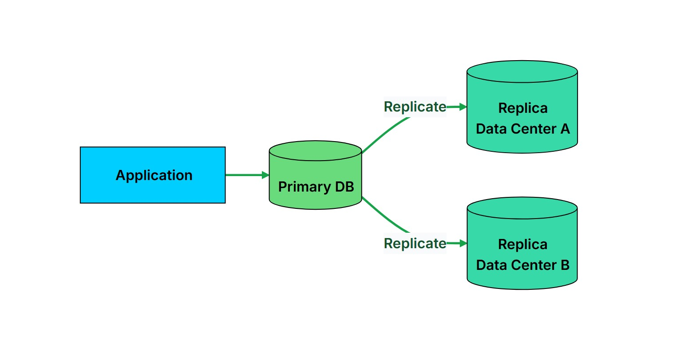
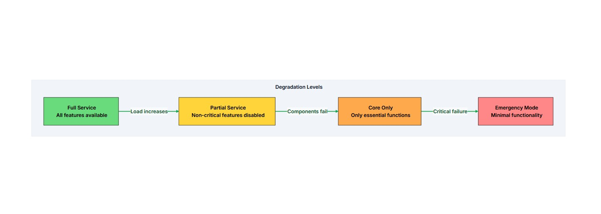
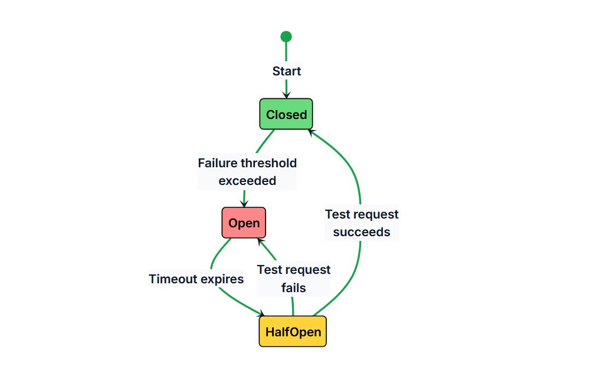
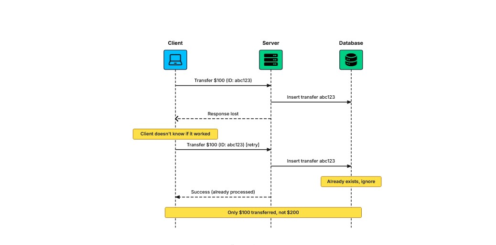

# Reliability

A system that stays up but occasionally produces wrong answers is not actually serving its users.

**Reliability** means a system performs its intended function correctly and consistently, even in the face of faults.

- **Availability:** Is the system up?
- **Reliability:** Is the system doing what it should?

### Example

A payment system that is always available but occasionally charges customers twice is:

- Available
- Not Reliable

A messaging app that delivers messages out of order is also available but not reliable.

> Users tend to lose confidence in a system that gives wrong answers faster than in one that occasionally goes down.

---

# What is Reliability?

**Reliability** is the probability that a system will perform its intended function correctly over a given period of time, under specified conditions.

- **Correctly:** Produces the right output.
- **Over a given period:** Reliability is measured over time.
- **Under specified conditions:** Defines what normal operation looks like.

> An available system responds. A reliable system responds correctly.

---

# Reliability vs Related Concepts

| Concept | Question | Example |
|---|---|---|
| **Availability** | Is the system responding? | System returns HTTP 200 |
| **Reliability** | Is the response correct? | The balance returned is accurate |
| **Fault Tolerance** | Does it keep working when components fail? | Works with one database replica down |
| **Durability** | Is data preserved despite failures? | Data survives disk failure |

### Examples

A payment system that charges customers twice is:

- **Available** → It processes requests.
- **Unreliable** → It processes them incorrectly.

A database that loses writes during failover is:

- **Fault-Tolerant** → It continues operating.
- **Not Durable** → Data was lost.

These properties are related but independent.

A system that aggressively caches data for availability might serve stale responses, trading reliability for uptime.

---
## Measuring Reliability

### MTBF

Average time between failures.

`MTBF = Total Operating Time / Number of Failures`

* Higher MTBF → fewer failures.

### MTTR

Average time to recover after a failure.

`MTTR = Total Downtime / Number of Failures`

* Lower MTTR → faster recovery.
* Includes detection, diagnosis, repair, verification.

### Error Rate

Percentage of failed requests.

`Error Rate = Failed Requests / Total Requests × 100%`

### Data Correctness

Percentage of responses containing correct data.

> High availability doesn't mean reliable if the system returns wrong data.

---

## Why Systems Fail

* **Hardware Failures** → disks, memory, CPU, network.
* **Software Bugs** → especially bugs that silently return wrong results.
* **Configuration Errors** → small mistakes can take down services.
* **Human Error** → bad commands, untested deployments, wrong diagnosis.
* **Overload** → can cause cascading failures through queues, timeouts, and retries.

---

## Reliable System Principles

* **Redundancy** → Backup components.
* **Failover** → Automatically switch to a backup.
* **Load Balancing** → Distribute traffic and avoid a single point of failure.
* **Monitoring & Alerting** → Detect problems early.
* **Graceful Degradation** → Keep core functionality working when parts fail.

---
# Techniques to Enhance Reliability

## 1. Redundant Architectures

* Have **more components than needed**.
* If one fails, others continue working.
* Example: multiple web servers behind a **Load Balancer**.

```text
Users
  ↓
Load Balancer
  ↓
Server 1
Server 2
Server 3
```

> One server fails → traffic goes to the remaining servers.

---

## 2. Data Replication


* Don't store data in a **single location**.
* Replicate data across multiple databases or data centers.

> If one database fails → access a copy from another location.

---

## 3. Graceful Degradation


When parts fail, keep **core functionality** working instead of taking the whole system down.

```text
Full Service
    ↓
Partial Service
    ↓
Core Only
    ↓
Emergency Mode
```

Example:

* **Full:** All features
* **Partial:** Non-critical features disabled
* **Core:** Essential features only
* **Emergency:** Minimal functionality / cached data

---

## 4. Circuit Breakers


Prevent one failing service from causing **cascading failures**.

### States

```text
Closed
  ↓ failure threshold
Open
  ↓ timeout
Half-Open
  ↓
Success → Closed
Failure → Open
```

* **Closed** → Requests pass normally; failures are counted.
* **Open** → Requests fail immediately without calling the dependency.
* **Half-Open** → Limited test requests are allowed.

> Protects the failing service and gives it time to recover.

---

## 5. Idempotency


Network failures can make it unclear whether a request succeeded.

If you retry, the operation might execute twice.

**Idempotent operation:**

> Same result regardless of how many times it is executed.

### Idempotency Key

```text
Transfer $100
ID: abc123
      ↓
Retry with abc123
      ↓
Already processed → Don't execute again
```

* Server stores the **Idempotency Key** with the result.
* Same key → return the stored result instead of executing again.
* Important for **payment / money-moving operations**.

